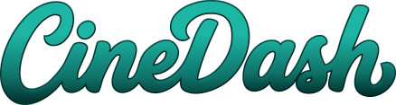

---

# Oi, eu sou o Lucca! 👋🏽

Esse projeto chama-se CineDash e faz parte do processo seletivo da [Inbazz](https://inbazz.com.br/). Ele consiste em consumir a API da [The Movie Database (TMDB)](https://www.themoviedb.org/?language=pt-BR) e criar um web app bem completo, utilizando a seguinte stack:

- Core: React 18+, TypeScript (Strict), Vite.
- Server State & Cache: TanStack Query.
- Client State: Zustand.
- Routing: TanStack Router (Preferencial) ou React Router v6 (com Data Loaders).
- UI Components: Shadcn/ui + TailwindCSS.
- Formulários: React Hook Form ou TanStack Form + Zod (validação).
- Testes: Vitest + React Testing Library.

Essa oportunidade foi incrível e me permitiu ter contato com algumas tecnologias novas que ainda não tinha tido a chance de explorar. Mesmo com uma semana um pouco atípica, que acabou impactando o tempo que eu gostaria de ter dedicado, procurei cobrir tudo o que estava ao meu alcance, da melhor forma possível dentro do cenário que tive.

Dentro de `ARCHITECTURE.md` há mais detalhes sobre a implementação e em `INSTRUCTIONS.md` estão as instruções para executar o projeto.
